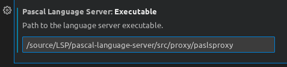

# Pascal Language Server

An [LSP](https://microsoft.github.io/language-server-protocol/) server
implementation for Pascal variants that are supported by [Free
Pascal](https://www.freepascal.org/), including Object Pascal. It uses
[CodeTools](https://wiki.lazarus.freepascal.org/Codetools) from
Lazarus as backend.

## Features

The implementation is still incomplete.

### Implemented Methods

 - textDocument
   - declaration
   - implementation
   - references
   -  signatureHelp
   - documentSymbol (only `SymbolInformation`)
   - documentHighlight
   - completion
 - window
   - showMessage
 - workspace
   - symbol
   - executeCommand
- diagnostics (incomplete)

### Initialization Options

Editors can supply [initialization options](https://microsoft.github.io/language-server-protocol/specifications/specification-3-15/#initialize) to the server, however each client handles this differently so please refer to your editors LSP plugin for more information.

The follow options are supported:

```json
"initializationOptions":
{
  "fpcOptions":
  [
    "-Fu/path/to",
    "-Fi/path/to",
    "-dMY_MACRO"
  ],
  "symbolDatabase": "/path/to/symbols.db",
  "program": "pasls.lpr"
}
```

 - `fpcOptions`: compiler flags used to specifiy paths, macros etc...
 - `symbolDatabase`:  if a valid path is provided the server will use an SQL database to store symbol information (recommended for faster documentSymbol queries).
 - `maximumCompletions`: the maximum number of completions returned per query. If the maximum is exceeded then `CompletionList.isIncomplete` will be set to true and results will be recomputed as the user types.
 - `overloadPolicy`: The preferred method to handle overloaded functions in document symbol requests.

Macros are supported in initialization options. The following macros will be expanded:

- `$(tmpdir)` - Path to your systems temporary directory.
- `$(root)` - Path to the rootURI as specified by the clients [initialize request](https://microsoft.github.io/language-server-protocol/specifications/specification-3-15/#initialize).

The following macro formats are valid:

- `$macro`
- `$MACRO`
- `$(macro)`
- `$(MACRO)`

### Optional Settings

Boolean values used in *initializationOptions*.

```json
// procedure completions with parameters are inserted as snippets
insertCompletionsAsSnippets
// procedure completions with parameters (non-snippet) insert
// empty brackets (and insert as snippet)
insertCompletionProcedureBrackets
// workspaces folders will be added to unit paths (i.e. -Fu)
includeWorkspaceFoldersAsUnitPaths
// workspaces folders will be added to include paths (i.e. -Fi)
includeWorkspaceFoldersAsIncludePaths
// syntax will be checked when file opens or saves
checkSyntax
// syntax errors will be published as diagnostics
publishDiagnostics
// enable workspace symbols
workspaceSymbols
// enable document symbols
documentSymbols
// completions contain a minimal amount of extra information
minimalisticCompletions
// syntax errors as shown in the UI with ‘window/showMessage’
showSyntaxErrors
```

### TODO:

 - Optional properties are not implemented so the JSON payloads are bloated.
 - `documentHighlight` should select the begin/end keywords only.
 - `textDocument/codeAction`
- `DocumentSymbol`class for document symbols

## Clients

### Emacs

To use the server from `lsp-mode` in Emacs, install the separate
[`lsp-pascal`](https://github.com/arjanadriaanse/lsp-pascal) module.

### Sublime Text

Example settings JSON for the [LSP](https://github.com/sublimelsp/LSP) package on macOS.

```json
"pascal-language-server":
{
  "command":
  [
    "/pascal-language-server/lib/x86_64-darwin/pasls"
  ],
  "env":
  {
    "FPCDIR": "/usr/local/share/fpcsrc",
    "FPCTARGET": "darwin",
    "FPCTARGETCPU": "x86_64",
    "LAZARUSDIR": "/usr/share/lazarus",
    "PP": "/usr/local/lib/fpc/3.0.4/ppcx64"
  },
  "initializationOptions": {
    // global options which apply to all projects
  },
  "languageId": "pascal",
  "scopes":
  [
    "source.pascal"
  ],
  "syntaxes":
  [
    "Packages/FPC/FPC.sublime-syntax"
  ]
}
```

### Visual Studio Code

Install the [extension](
https://github.com/genericptr/pasls-vscode) and configure the settings accordingly. You must have the actual language installed before the extension will work.


## Building

Requires Free Pascal Compiler version 3.2.0 and Lazarus version 2.0.8,
open the project file in Lazarus or use the commandline:

```sh
lazbuild src/standard/pasls.lpi
```

## Debugging the LSP server

### The problem

VS Code and other editors that use the LSP server start the LSP server and
send messages in JSON-RPC style to standard input, and read replies through
standard output. This makes the LSP server process hard to debug.

### The solution
To solve this, 2 extra projects have been added:

- **paslssock**:  a LSP server that reads messages from a TCP/IP or Unix
  socket and sends replies back through the socket.

- **paslsproxy**: This is a drop-in replacement for pasls: It is a LSP server
  that acts as a proxy: it reads messages from standard input (just as
  pasls), but sends them to a TCP/IP or Unix socket. It reads the replies
  from the socket and writes them to standard output.

Both programs have a -h or --help commandline option which will display all
configuration options.

### Configuration  

#### paslssock
The paslssock server can read an initialization file with 2 sections, 
`Server` and `CodeTools`. These can be used to set another port on which to
listen, and to specify values for the environment variables that are normally sent by the
client.

```ini
[Server]
Port=10090

[CodeTools]
Compiler=/usr/local/bin/ppcx64-3.2.2
FPCDir=/home/michael/FPC/build/svn/tag_3_2_2/fpcsrc
LazarusDir=/home/michael/projects/lazarus
TargetOS=linux
TargetCPU=x86_64
```

The default location for this configuration file is `/etc/paslssock.cfg` on unix, and next to the
executable on Windows.

#### paslsproxy
The proxy can also be configured with an  initialization file with 1
section: `Server`. This can be used to set the port on which the server is
listening.

```ini
[Server]
Port=10090
```

The default location for this configuration file is `/etc/paslsproxy.cfg` on unix, and next to the
executable on Windows.

### Usage

1. Configure the socket process and proxy process. Both can be configured
   through a command-line option or a configuration file.

   By default the server listens on port 9898 and the proxy connects through
   this port.

   For both processes you can specify a log file which will log all communication to that logfile.

2. Start the socket server process (in the IDE or debugger of your choice)
   before you start the editor that uses the language server.

3. Configure VS Code (or any other edit) to use the proxy process instead of the standard pasls executable.
   Simply replace the full path to pasls to the full path to paslsproxy:




4. Happy debugging !
