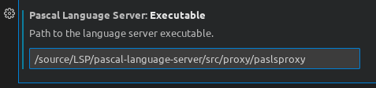

# Pascal Language Server

An [LSP](https://microsoft.github.io/language-server-protocol/) server
implementation for Pascal variants that are supported by [Free
Pascal](https://www.freepascal.org/), including Object Pascal. It uses
[CodeTools](https://wiki.lazarus.freepascal.org/Codetools) from
Lazarus as backend.

## Features

To see the full list of implemented server capabilities in the current version use the command:

  `pasls -h`

### Extra commands to be executed with **executeCommand**:

* **pasls.completeCode** Complete code at cursor. Takes DocumentUri and
  Position as options.
* **pasls.formatCode** Format current file. Takes documentUri and Config file URI as options. 
  The configuration file is the Jedi Code Formatter configuration file. You
  can find an example in the Lazarus settings directory **~/.lazarus/jcfsettings.cfg**.
  An extra example is included in this repository in **Sample-Formatting.cfg**

### Initialization Options

Editors can supply [initialization options](https://microsoft.github.io/language-server-protocol/specifications/specification-3-15/#initialize) to the server, however each client handles this differently so please refer to your editors LSP plugin for more information.

To see the available list of options in the current version use the command:

  `pasls -h`

Clients should include these in their configuration files but you can verify they're up to date using `-h`.

Macros are supported in initialization options. The following macros will be expanded:

- `$(tmpdir)` - Path to your systems temporary directory.
- `$(root)` - Path to the rootURI as specified by the clients [initialize request](https://microsoft.github.io/language-server-protocol/specifications/specification-3-15/#initialize).

The following macro formats are valid:

- `$macro`
- `$MACRO`
- `$(macro)`
- `$(MACRO)`

## Clients

### Emacs

To use the server from `lsp-mode` in Emacs, install the separate
[`lsp-pascal`](https://github.com/arjanadriaanse/lsp-pascal) module.

### Sublime Text

Install the [package](
https://github.com/genericptr/pasls-sublime-text) and configure the settings accordingly. Requires the [LSP](https://github.com/sublimelsp/LSP) package.

### Visual Studio Code

Install the [extension](
https://github.com/genericptr/pasls-vscode) and configure the settings accordingly. You must have the actual language installed before the extension will work.


## Building

Requires Free Pascal Compiler version 3.2.0 and Lazarus trunk sources.

To build using Lazarus, you need to follow the following steps:

* Update or download the sources from gitlab:
[https://gitlab.com/freepascal.org/lazarus/lazarus](https://gitlab.com/freepascal.org/lazarus/lazarus)

* Open the jcfbase package in the lazarus IDE. It is located in the
  `components/jcf2` directory.  You can compile this package in the IDE.
  
  You need to do this only once, so Lazarus knows about the jcfbase package.
  (unless you wish to update the Jedi Code Formatter)

* open the `lspprotocol.lpk` package in Lazarus. It is located in the
  [src/protocol](src/protocol) directory.
  You can compile this package in the IDE, but this is not needed: The
Lazarus IDE and Lazbuild simply need to know where it is located.

* open the `lspserver.lpk` package in Lazarus. It is located in the
  [src/serverprotocol](src/serverprotocol) directory.
  You can compile this package in the IDE, but this is not needed: The
Lazarus IDE and Lazbuild simply need to know where it is located.

* open the `src/standard/pasls.lpi` project file in Lazarus, and compile the
  program. or use the lazbuid commandline:

```sh
lazbuild src/standard/pasls.lpi
```
The `lspprotocol.lpk` package and `pasls.lpi` are both in the
`pascallanguageserver.lpg`project group; if you have project group support enabled,
then you can use this to compile this package and the executable.

## Debugging the LSP server

### The problem

VS Code and other editors that use the LSP server start the LSP server and
send messages in JSON-RPC style to standard input, and read replies through
standard output. This makes the LSP server process hard to debug.

### The solution
To solve this, 2 extra projects have been added:

- **paslssock**:  a LSP server that reads messages from a TCP/IP or Unix
  socket and sends replies back through the socket.

- **paslsproxy**: This is a drop-in replacement for pasls: It is a LSP server
  that acts as a proxy: it reads messages from standard input (just as
  pasls), but sends them to a TCP/IP or Unix socket. It reads the replies
  from the socket and writes them to standard output.

Both programs have a -h or --help commandline option which will display all
configuration options.

### Configuration  

#### pasls
The standard language server reads configuration in this order:

1. built-in defaults
2. `/etc/pasls.cfg`
3. `~/.pasls.cfg`
4. `.pasls.cfg` in the workspace root
5. process environment variables
6. LSP initialization options

Project selections are saved only to the workspace `.pasls.cfg`. If multiple
main programs are discovered, clients can call `pasls.selectMainProgram` with
the selected `.lpr` or `.dpr` path to persist it.

```ini
[Project]
MainProgram=src/app.lpr

[PasLS]
CodeToolsConfig=codetools.config
LazarusConfig=.lazarus

[CodeTools]
Compiler=/usr/bin/fpc
FPCDir=/usr/share/fpcsrc
LazarusDir=/usr/share/lazarus
TargetOS=linux
TargetCPU=x86_64
FPCOptions=-Fuunits -Fiinclude -dDEBUG
```

#### paslssock
The paslssock server can read an initialization file with 2 sections, 
`Server` and `CodeTools`. These can be used to set another port on which to
listen, and to specify values for the environment variables that are normally sent by the
client.

```ini
[Server]
Port=10090

[CodeTools]
Compiler=/usr/local/bin/ppcx64-3.2.2
FPCDir=/home/michael/FPC/build/svn/tag_3_2_2/fpcsrc
LazarusDir=/home/michael/projects/lazarus
TargetOS=linux
TargetCPU=x86_64
```

The default location for this configuration file is `/etc/paslssock.cfg` on unix, and next to the
executable on Windows.

#### paslsproxy
The proxy can also be configured with an  initialization file with 1
section: `Server`. This can be used to set the port on which the server is
listening.

```ini
[Server]
Port=10090
```

The default location for this configuration file is `/etc/paslsproxy.cfg` on unix, and next to the
executable on Windows.

### Usage

1. Configure the socket process and proxy process. Both can be configured
   through a command-line option or a configuration file.

   By default the server listens on port 9898 and the proxy connects through
   this port.

   For both processes you can specify a log file which will log all communication to that logfile.

2. Start the socket server process (in the IDE or debugger of your choice)
   before you start the editor that uses the language server.

3. Configure VS Code (or any other edit) to use the proxy process instead of the standard pasls executable.
   Simply replace the full path to pasls to the full path to paslsproxy:




4. Happy debugging !
